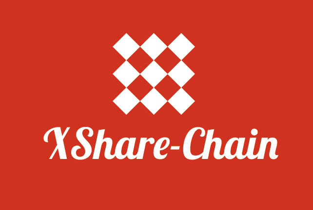

# XShareChain全球闲置物品共享链白皮书
<div style="text-align:center">

</div>
<br/>
全球网民参与共治的闲置物品共享链

## 目录
* 1、前言
  * 1.1 项目背景
  * 1.2 机遇 
* 2、XShareChain全球闲置物品共享链
  * 2.1 区块链是什么
  * 2.2 智能合约是什么
  * 2.3 XShareChain整体架构
  * 2.4 XShareChain核心技术特性
      * 2.4.1 保值货币XShareCoin
      * 2.4.2 共识系统
      * 2.4.3 志愿巡警XSharePolice
      * 2.4.4 交易机制
      * 2.4.5 评价机制
      * 2.4.6 交易有效性自动审核机制
      * 2.4.7 奖励&惩罚机制
  * 2.5 边界异常处理 
      * 2.5.1 51%攻击 
      * 2.5.2 用户疯狂上链闲置物品导致货币XShareCoin价格暴涨
      * 2.5.3 用户结盟下链闲置物品导致货币XShareCoin价格暴跌
      * 2.5.4 投机者操纵货币XShareCoin价格导致暴涨暴跌
      * 2.5.5 其他技术故障
  * 2.6 路线图
  * 2.7 生态&矩阵
* 3、治理&架构哲学
  * 3.1 XShareChain自治委员会
  * 3.2 选举机制
      * 3.3.1 周期
      * 3.3.2 主席
      * 3.3.3 委员 
  * 3.3 经济
      * 3.2.1 资金来源
      * 3.2.2 使用预算
      * 3.2.3 财务计划
      * 3.2.4 定期报告
      * 3.2.5 数字资产管理
* 4、团队介绍
  * 4.1 项目顾问
  * 4.2 创造团队人员名单
  * 4.3 赞助者名单
* 5、实施计划
* 6、联系信息
* 7、参考文献

## 1、前言
基于区块链技术的比特币从2009年的0.003美元涨到2017年12月18日 19013美元，上涨600多万倍，创造了一个又一个财富传奇。2010年，美国的程序员拉丝勒•豪涅茨(Laszlo Hanyecz)用1万枚比特币交换了两块价值25美金的披萨，现在看来相当于用了1亿美元买了一块披萨，成为“史上最贵披萨”。

事实胜于雄辩，去中心化的区块链已经逐步得到全球网民的认可，现在正快速地应用到各行各业。

2018年将成为区块链创业大年。

XShareChain是基于区块链技术打造的全新的公链，用来解决全球闲置物品残值有效、公正、合理的利用问题。XShareChain不依赖于任何已有的公链，因为Kenny（XShareChain的发起人）不希望因为依赖某个公链，实际上加重了那些公链的中心化地位，导致垄断和不公正发生。

同时，Kenny认为XShareChain不属于任何国家、组织和个人，它归属于参与进来共建的全球网民。

### 1.1 项目背景
**互联网第一波只是交换信息，但到了第二波希望能够交换价值**。

交换价值的核心前提就是要参与者要有一个**共识机制**。在区块链之前的 Distributive System（分布式）系统里面，达到共识是一个非常难的事情，每个网络的节点都有时间的延迟，计算能力也不一样。有的计算机有良好的行为，有的计算机确实有一些不良行为。在一个复杂的网络系统里面，如何达到一个共同的价值，这在那个计算机科学里面也是一直没有解决的问题。因此计算机科学中有一个 Fischer-Lynch-Paterson 定理，在采取一种完全 Deterministic（固定）算法的时候，共识是永远无法达到的，因为这个网络的系统实在太复杂。

后来，大家就想到区块链的技术可以把经济行为加上随机的数学算法使得网络达到共识，比如说通过计算一个 Hash 函数的办法，对共识进行投票，这就是整个区块链上面达到了一个新共识的机制。

为什么这个共识的机制本身会有很大的价值？

事实上物理学里面有一个非常深刻的概念叫熵增，就是物理世界看起来是总是走向无序。但是生命世界和物理世界不太一样，生命世界确实越来越走向有序。走向有序的行为是把熵减少的一个行为，但是整个系统的熵还是在增大。因此，生命行为就是把自己的熵减小了，使周围的熵增大了。
这在共识机制上也是一样。如果我们要达到共识就是要把熵减少，大家如果意见非常不一样的话，熵也就很大，因为非常无序。但是如果能够统一意见，达到一种非常有序的状态，它必然是减小熵的一种行为。然而，减少熵的行为必然会增高周围世界的熵。

因此，当时提出来的算法是通过一些 Hash 函数的计算，这虽然看起来是浪费了一些周围世界的能量，其实得到了一种更可贵的财富，也就是共识。

在这个意义下，区块链的共识系统有点像生命系统本身，自己的熵在减弱，它达到了共识，但使得周围的系统熵变大。这是一个代价，但相比别的系统来讲，这个代价还是非常小。

所以，一旦我们有了共识之后，就会有一种信任，人和人之间会有一个新的合作机会。所以，我把这个新的时代称为：我们的信念是建筑在一个数学的算法上面，In math we trust。在今后的系统中，中心化平台就不再需要，取而代之的是我们能够建立一些P2P的区块。通过开源的投票模式，大家可以用透明的算法，定义这个Community (生态链）里面的游戏规则。这就更能导致一个新的互联网的革命，一个合久必分的时代就又会到来。

### 1.2 机遇
现有的中心化闲置物品共享经济平台，比如滴滴打车、闲鱼，存在较突出的问题如下：

* 中心化平台佣金比例过高，普通用户很难挣钱；
* 中心化平台利用垄断优势对平台用户推行霸权条款；
* 恶意用户刷信誉刷评论虚假宣传，骗取普通用户信任；
* 黑客利用中心化平台漏洞，侵占平台用户的利益；
* 因为激励不到位，中心化平台客服服务水平普遍不高；
* 中心化平台为了实现更高的经济效益暗箱操作，更改排名、等级、交易数据等，甚至明码标价出售各种广告位；
* 中心化平台可能会在某些高峰期吞吐量不够而短暂性崩溃，比如春节12306订票网站；

以上所有问题，造成现有中心化的共享经济平台共享物品流通成本极高，除了极少数头部用户能实现盈利，大多数用户是赔钱买乐趣，参与的意愿并没有得到有效激励。因此，很多普通用户不愿意将家里的闲置物品共享出来，宁可放在角落让其不断折旧贬值，这已经造成了社会资源巨大浪费。

我们（以后“我们”皆指代XShareChain的创造团队）提出“XShareChain”这一“全球闲置物品共享链”，依靠区块链技术和智能合约，以期打造一个全球网民参与共治、互惠多赢、透明公正的生态链（Community）。

## 2、XShareChain全球闲置物品共享链
### 2.1 区块链是什么
@ZH
### 2.2 智能合是什么
@ZH
### 2.3 XShareChain整体架构
（图）
### 2.4 XShareChain核心技术特性
#### 2.4.1 保值货币XShareCoin
众所周知，一个经济体内**为了高效地实现价值交换，必须有货币充当媒介。**
为方便用户在XShareChain上交易，XShareChain会基于全球闲置物品价值总量发行加密数字代币，名字叫XShareCoin，API如下：


```javascript
{
    "name":"xsharecoin",
    "id":"88998888900",//每1枚XShareCoin都有自己的编号
    "value":"0.16875",//面额
    "owner":"",//当前拥有者签名
    "lastowner":""//上一拥有者签名
}
```


XShareCoin不同于ICO，不是必须与比特币等主流数字货币打通兑换关系，也不是一定要上交易所参与交易。虽然技术上ICO没有障碍，Kenny认为中国国情下，不用ICO也可以做得很好。

> 全球顶级战略管理咨询公司罗兰贝格2016年底发布共享经济报告指出，至2018年，全球共享经济规模有望达到5200亿美元（约36000亿人民币）。

因此，XShareChain理论上可以发行5200亿美元估值规模的XShareCoin数量。考虑到市场将上不只存在一个共享链（人们也不期望一个垄断链存在导致中心化），按10%市场占有率做预估，发行量为：

> 5000万枚 XshareCoin = 500亿美元<br>
> 1枚XshareCoin = 1000美元

XShareCoin的价值支撑在于全球网民已上链闲置物品的价值，因此，随着上链用户增加，上链物品增多，XShareCoin初期会有增值预期。随和新物品不断上链，旧物品下链，新陈代谢，XShareCoin价值逐渐趋于稳定。

综上，XShareCoin（单位：$）的价值f(x)为，其中x为已上链共享物品数量：

```math
0<f(x)<1000

lim_{x \to \infty}f(x) = 1000
```


### 2.4.2 共识机制
既然XShareChain不依赖于任何已有的公链，那么XShareChain的共识机制也是与其他公链不一样的。请允许我们以最通俗的语言来解释：

* 当某个网民在XShareChain上链（成功提交）一个闲置物品，会获得n个XShareCoin的奖励；
* 奖励的数量由智能算法（名叫“XShareMatrix”）自行确定，不受任何人影响；
* XShareMatrix依靠图像识别、语义分析、以及大数据等技术实现，会确定该物品的一个价值；
* XShareMatrix是开源的，由XShareChain用户参与共建，并由自治委员会授权我们实现；
* XShareMatrix运行在网民的手机里，XShareChain随机抽取51%的用户投票决定价格；
* 投票完成之后，XShareChain发放相当的XShareCoin；
* 随着时间推移，该闲置物品的价值会自动逐渐降低（折旧），也是依靠XShareMatrix计算然后投票确定价值，体现在以XShareCoin的标价降低；
* 如果某个网民下链（回收）该物品，会从该网民的钱包里面扣除等价的XShareCoin；
* 没有XShareCoin的用户如果要想在XShareChain上与其他人交易，可以用法币购买某些用户的XShareCoin然后交易；


*（未完，请等待我们内部审校，持续更新……）*